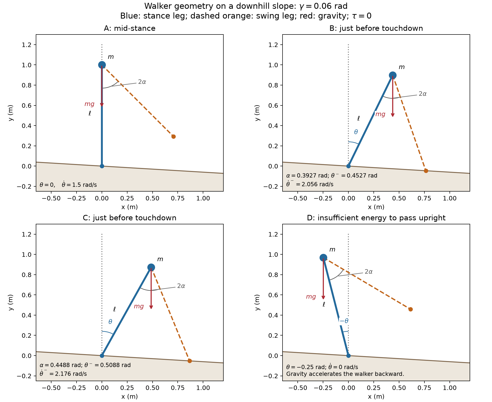
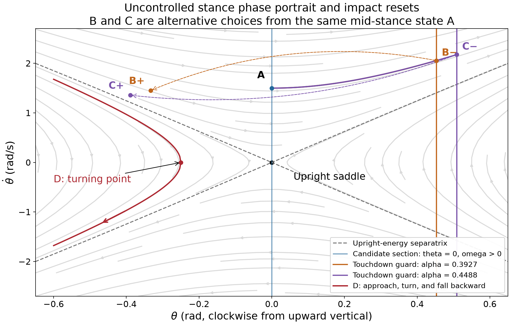
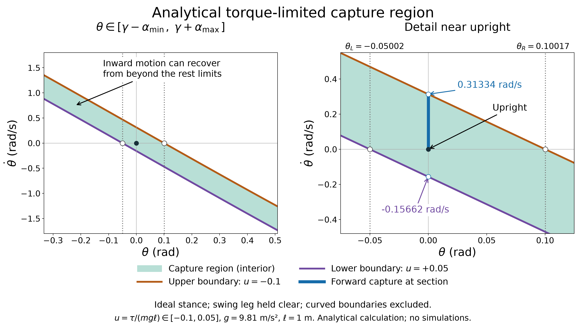
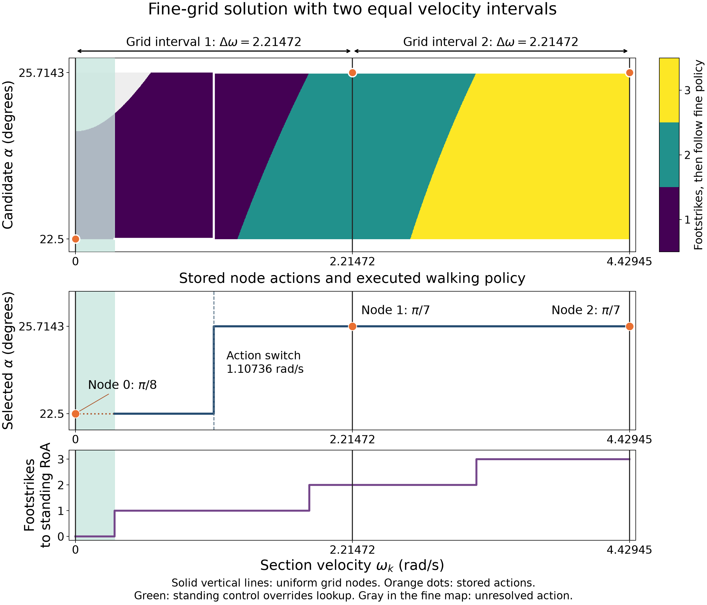
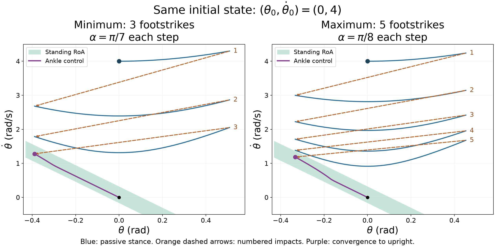
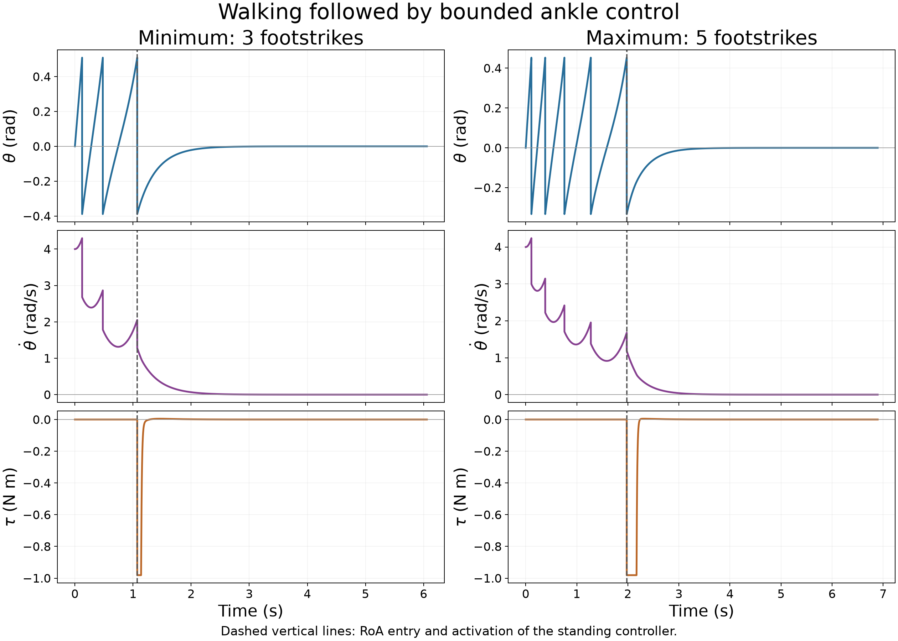
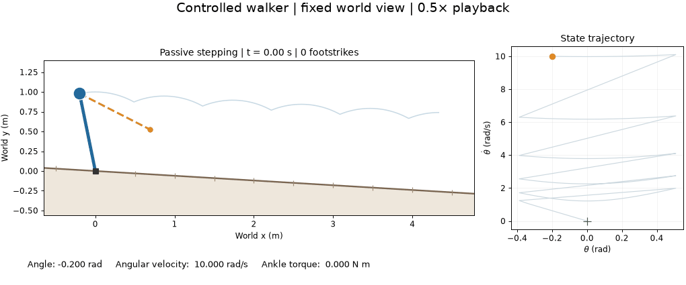

# Assignment 2: Inverted Pendulum Walker

The report is organized with `codes/` for implementation and tests and `figures/` for generated plots, animations, and numerical results. Run the commands below from the repository root. Image and file links are relative to this report.

## 1. Model sketches and state-space geometry

This section develops the geometry before implementing the simulation and controllers. The figures are analytical sketches; the implemented simulation is described in Section 5.5. We use $m=1$ kg, $\ell=1$ m, $g=9.81$ m/s², and a downhill slope $\gamma=0.06$ rad.

### 1.1 State and controls

The state is $x=[\theta,\dot\theta]^T$, where $\theta$ is measured clockwise from upward vertical and $\dot\theta$ is its angular velocity. Positive rotation carries the walker forward down the slope.

Both legs are massless and have length $\ell$. The angle between the stance and swing legs is $2\alpha$, where

$$
\frac{\pi}{8}\leq\alpha\leq\frac{\pi}{7}.
$$

The stepping controller chooses $\alpha$ once per stance phase; the idealized swing leg can be repositioned instantaneously. The ankle torque $\tau$ can be updated every simulation timestep, subject to

$$
-0.1mg\ell\leq\tau\leq0.05mg\ell.
$$

The sketches below use $\tau=0$ to show the passive stance dynamics. The swing foot is airborne between impacts; the model has no whole-body flight phase.

### 1.2 Walker snapshots



- **A — Mid-stance:** $\theta=0$ and $\dot\theta=1.5$ rad/s. The mass is directly above the stance foot but continues moving forward; this is not standing equilibrium.
- **B — Touchdown with $\alpha=\pi/8$:** the forward swing foot reaches the slope at $\theta^-=\gamma+\alpha\approx0.4527$ rad.
- **C — Touchdown with $\alpha=\pi/7$:** the larger leg separation delays contact to $\theta^-\approx0.5088$ rad. B and C are alternative steps starting from A, not successive impacts on one trajectory.
- **D — Backward-fall failure:** at $\theta=-0.25$ rad and $\dot\theta=0$, the walker has stopped before passing upright. With zero ankle torque, $\ddot\theta=(g/\ell)\sin\theta<0$, so it accelerates backward. This is a failure to continue forward walking, not a numerical failure boundary or a computed controller RoA.

In the sketches, $m$ labels the point mass, $mg$ labels the downward gravity force, $\ell$ labels leg length, and $2\alpha$ labels the full angle between the legs. In D, the arc is labeled $-\theta$ because it shows the positive magnitude of a negative stance angle.

### 1.3 Touchdown guards and impact resets

For the relevant forward step, touchdown occurs at

$$
\boxed{\theta^-=\gamma+\alpha,\qquad\dot\theta^->0.}
$$

The superscripts $-$ and $+$ denote the states immediately before and after impact, respectively. Here $\gamma$ is the downhill slope angle and $\alpha$ is half the angle between the legs.

A convenient guard is $q(\theta)=\theta-(\gamma+\alpha)=0$, crossed from negative to positive. The direction condition prevents a reverse crossing from being mistaken for forward touchdown. In the phase portrait, each fixed $\alpha$ gives a vertical touchdown line. Increasing $\alpha$ moves that line to the right. Only the forward crossing is active, although the full lines are drawn for reference.

For an instantaneous, perfectly inelastic leg exchange with no push-off, the rimless-wheel impact map is

$$
\boxed{\theta^+=\theta^- -2\alpha=\gamma-\alpha,\qquad
\dot\theta^+=\cos(2\alpha)\dot\theta^-.}
$$

Here $\alpha$ is the angle used for the step that just ended. Selecting the next swing-leg angle does not change the new stance state. Angular momentum about the new contact gives the velocity projection, and the collision reduces kinetic energy by the factor $\cos^2(2\alpha)$. The dashed arrows in the phase portrait denote instantaneous resets, not continuous motion through intermediate states.

### 1.4 State-space sketch

For zero ankle torque, stance obeys

$$
\dot\theta=\omega,\qquad\dot\omega=\frac{g}{\ell}\sin\theta.
$$

Its conserved mechanical energy, with potential measured from stance-foot height, is

$$
E=\frac12m\ell^2\omega^2+mg\ell\cos\theta.
$$

The upright equilibrium $(0,0)$ is a saddle. Its energy level $E=mg\ell$ gives the separatrix

$$
\omega=\pm\sqrt{\frac{2g}{\ell}(1-\cos\theta)}.
$$

A forward-moving state behind upright needs energy strictly above $mg\ell$ to pass through upright with positive speed. At the threshold it approaches upright asymptotically; below it, it turns back. This is a passive-energy statement, not a characterization of the controlled RoA.



The gray arrows show continuous stance flow. A, B−, C−, and D correspond to the physical snapshots; B+ and C+ are their post-impact states. The colored forward curves follow the conserved energy from A. The red curve reaches D, turns, and falls backward. Background flow is the unconstrained pendulum field; actual walker motion must terminate or reset at the appropriate events.

A useful candidate Poincaré section is $\theta=0$ with $\omega>0$. It is independent of $\alpha$, and the crossing is transverse because $\dot\theta=\omega>0$. The equilibrium itself is excluded. A later return-map implementation must separately handle trajectories that reach the standing controller's RoA or fail before returning to this section.

### 1.5 Reproducing the sketches

From the repository root, run:

```bash
uv run python assignment_2/codes/sketch_assignment_2.py
```

The script generates both figures under `figures/`. Images and the GIF embedded in this report are included in the repository so that GitHub can display them. Other generated numerical results remain ignored; the code can regenerate all artifacts.

## 2. Standing controller and region of attraction

### 2.1 Analytical torque-limited capture region

Before selecting gains, consider the set recoverable by some admissible torque policy. This is a control capability bound, not yet the RoA of a specific feedback-linearizing PD controller. Assume ideal stance with the swing leg held clear, immediate torque switching, and no additional contact or full rotations.

Normalize torque as $u=\tau/(mg\ell)\in[-a,b]$, with $a=0.1$ and $b=0.05$. Then

$$
\ddot\theta=\frac{g}{\ell}(\sin\theta+u).
$$

The limiting balance angles are $\theta_L=-\arcsin b=-0.05002$ rad and $\theta_R=\arcsin a=0.10017$ rad. Integrating $\omega\thinspace d\omega/d\theta=(g/\ell)(\sin\theta+u)$ under extreme torques gives

$$
F_R(\theta)=\frac{2g}{\ell}[\cos\theta_R-\cos\theta+a(\theta_R-\theta)],
$$

$$
F_L(\theta)=\frac{2g}{\ell}[\cos\theta_L-\cos\theta+b(\theta-\theta_L)].
$$

Over the selected display range $\theta\in[\gamma-\alpha_{\min},\gamma+\alpha_{\max}]=[-0.33270,0.50880]$ rad, the boundaries, including their inward-moving extensions, are

$$
\omega_+(\theta)=\begin{cases}
\sqrt{F_R(\theta)},&\theta\leq\theta_R,\\
-\sqrt{F_R(\theta)},&\theta>\theta_R,
\end{cases}
$$

$$
\omega_-(\theta)=\begin{cases}
\sqrt{F_L(\theta)},&\theta<\theta_L,\\
-\sqrt{F_L(\theta)},&\theta\geq\theta_L.
\end{cases}
$$

The shaded interior satisfies $\omega_-(\theta)<\dot\theta<\omega_+(\theta)$. The boundaries approach tilted balance states under maximal opposing torque and are excluded from upright capture. Beyond the balance angles, recovery requires inward velocity: the balance angles restrict recovery from rest, not all moving states. This plot shows a finite portion of the ideal standing capture set; additional physical constraints would need separate treatment.



At $\theta=0$, the interval is $-0.15662<\dot\theta<0.31334$ rad/s. Its forward portion is $0<\dot\theta<0.31334$ rad/s. These values follow directly from the formulas, with no trajectory simulations.

Reproduce the figure with `uv run python assignment_2/codes/plot_analytical_capture.py`.

### 2.2 Gain selection and analytical convergence proof

For the selected interval $I=[-0.3326991,0.5087990]$ rad, choose

$$
\boxed{k_p=240\ \mathrm{s}^{-2},\qquad k_d=80\ \mathrm{s}^{-1}.}
$$

Use the bounded feedback-linearizing controller

$$
\tau=\mathrm{clip}\left(-mg\ell\sin\theta-m\ell^2(k_p\theta+k_d\omega),-amg\ell,bmg\ell\right).
$$

This claim applies to the ideal continuous-time stance model with the swing leg held clear, without foot impacts or additional failure constraints. Define

$$
D=\lbrace (\theta,\omega):\theta\in I,\ \omega_-(\theta)<\omega<\omega_+(\theta)\rbrace .
$$

Every initial state in $D$ converges to $(0,0)$ under this controller. The two curved boundaries are excluded. The following establishes both invariance and convergence; it is not a simulation-based claim.

#### Boundary torque conditions

Let $q=g/\ell=9.81\ \mathrm{s}^{-2}$ and write the acceleration as

$$
f(\theta,\omega)=q\sin\theta+\mathrm{clip}(-q\sin\theta-k_p\theta-k_d\omega,-aq,bq).
$$

The upper capture boundary is the stable manifold of $(\theta_R,0)$ under the constant input $-aq$; the lower boundary is the stable manifold of $(\theta_L,0)$ under $bq$. The controller matches these inputs on the boundaries if

$$
q\sin\theta+k_p\theta+k_d\omega_+(\theta)>aq,
$$

$$
q\sin\theta+k_p\theta+k_d\omega_-(\theta)<-bq.
$$

We verify strict inequalities over the entire interval. Set $T=0.50879895$, $c=k_p/k_d=3\ \mathrm{s}^{-1}$, and

$$
s_{\min}=\sqrt{q\cos T}=2.92700688\ \mathrm{s}^{-1},\qquad
s_{\max}=\sqrt q=3.13209195\ \mathrm{s}^{-1}.
$$

The mean value theorem gives $\cos T\leq(\sin x-\sin y)/(x-y)\leq1$ for $x,y\in[-T,T]$. Applying this to the integrals defining $F_R,F_L$ yields

$$
s_{\min}|\theta-\theta_R|\leq\sqrt{F_R(\theta)}\leq s_{\max}|\theta-\theta_R|,
$$

and the corresponding bounds with $L$ replacing $R$. With the signs of the boundary branches, conservative uniform margins are

$$
\begin{aligned}
\delta_+ =\min\lbrace &s_{\min}\theta_R-(c-s_{\min})T,\ c\theta_R,\\
&s_{\max}\theta_R+(c-s_{\max})T\rbrace =0.24652533\ \mathrm{rad/s},
\end{aligned}
$$

$$
\begin{aligned}
\delta_- =\min\lbrace &-s_{\max}\theta_L-(s_{\max}-c)T,\ -c\theta_L,\\
&-s_{\min}\theta_L-(c-s_{\min})T\rbrace =0.08946168\ \mathrm{rad/s}.
\end{aligned}
$$

Thus $c\theta+\omega_+\geq\delta_+$ and $c\theta+\omega_-\leq-\delta_-$. A sufficient choice is

$$
k_d>\max\left\lbrace \frac{q(a+\sin T)}{\delta_+},\frac{q(b+\sin T)}{\delta_-}\right\rbrace
=58.89933\ \mathrm{s}^{-1}.
$$

Our choice $k_d=80$ satisfies this with positive acceleration margins of $13.96229$ and $1.88770$ rad/s². These conservative bounds cover the larger symmetric interval $[-T,T]$, so they also cover $I$.

#### Invariance and boundedness

On each curved boundary the controller gives exactly the constant saturated input that generates that boundary. The closed-loop vector field is locally Lipschitz, so solution uniqueness prevents an interior trajectory from crossing a boundary trajectory. At the left endpoint of $I$, both boundary velocities are positive; at the right endpoint, both are negative. Thus the flow points inward at the vertical edges.

Consequently, the closure of $D$ is compact and forward invariant, and an initial state strictly between the curved boundaries cannot reach them in finite time.

#### Convergence, including exclusion of boundary equilibria

Define $f_0(\theta)=f(\theta,0)$ and the energy-like function

$$
W(\theta,\omega)=\frac12\omega^2-\int_0^\theta f_0(s)\thinspace ds.
$$

It need not be positive over the entire capture region. It is continuously differentiable and bounded below on the compact invariant set, which is sufficient for the invariance argument. Since $f(\theta,\omega)$ is nonincreasing in $\omega$,

$$
\dot W=\omega[f(\theta,\omega)-f_0(\theta)]\leq0.
$$

For $\omega\ne0$, equality requires both control values to lie on the same saturation plateau. A nonstationary trajectory remaining in $\dot W=0$ must therefore follow one constant-torque system. It cannot switch plateaus without traversing a region of strict dissipation. Each constant-torque system on $I$ has strictly increasing acceleration with angle, since $q\cos\theta>0$. Its potential is strictly concave, so it has no nonconstant complete bounded orbit within $I$: a non-equilibrium orbit must leave the interval in at least one time direction. Hence the largest invariant subset of $\dot W=0$ consists only of the three equilibria

$$
(0,0),\qquad(\theta_L,0),\qquad(\theta_R,0).
$$

LaSalle's invariance principle implies convergence to one of these equilibria. The strict boundary torque inequalities give saturated neighborhoods of the two tilted equilibria. Their stable manifolds are exactly the corresponding capture boundary curves. An interior trajectory therefore cannot converge to either tilted equilibrium: if it did, it would eventually lie on that stable manifold, contradicting uniqueness and its interior initial state.

The remaining limit is

$$
\boxed{\theta(t)\to0,\qquad\dot\theta(t)\to0.}
$$

Near the origin the controller is unsaturated, so the local dynamics are $\ddot\theta+80\dot\theta+240\theta=0$, confirming local asymptotic stability. Together with the preceding global argument in $D$, this establishes coverage of the plotted capture interior under the stated assumptions.

Reproduce the numerical evaluations of the analytical inequalities with `python3 assignment_2/codes/verify_capture_gains.py`. No state-grid sampling or trajectory integration is used. Section 5 verifies this controller in a detailed trajectory experiment. Section 5.5 also runs it through the completed model functions in `codes/assignment_2.py`.

## 3. Poincaré map and uniform-grid lookup policy

### 3.1 Section and passive return map

Choose the forward Poincaré section $\theta=0$, $\omega_k=\dot\theta_k>0$. At each crossing, check for standing RoA entry first. Otherwise select the upcoming landing angle $\alpha_k$ and leave ankle torque at zero while walking.

Energy conservation during stance and the impact projection give

$$
(\omega^-)^2=\omega_k^2+\frac{2g}{\ell}[1-\cos(\gamma+\alpha_k)],
$$

$$
\theta^+=\gamma-\alpha_k,\qquad \omega^+=\cos(2\alpha_k)\omega^-.
$$

If the post-impact state is inside the standing RoA, activate the standing controller immediately. Otherwise, the next forward crossing, if it exists, has velocity

$$
\boxed{\omega_{k+1}=f(\omega_k,\alpha_k)=\sqrt{\cos^2(2\alpha_k)\left[\omega_k^2+\frac{2g}{\ell}(1-\cos(\gamma+\alpha_k))\right]-\frac{2g}{\ell}(1-\cos(\gamma-\alpha_k))}.}
$$

A positive radicand is required for a finite forward return. A zero radicand corresponds to asymptotic approach to upright; a negative one indicates reversal before upright. RoA entry takes priority over these passive-return outcomes. Here “capture” means reaching a state from which ankle control can stabilize the walker without another footstrike, not already being motionless.

For this analytical RoA, an uncaptured forward trajectory above its upper boundary cannot enter it later during passive stance: its energy is constant, while the boundary energy $q\cos\theta_R+aq(\theta_R-\theta)$ decreases as angle increases. A post-impact state below the lower boundary cannot be recovered even by maximum positive torque. Therefore initial and post-impact capture tests account for possible entry in these transitions. Capture checks include post-impact angles down to $\gamma-\alpha_{\max}=-0.388799$ rad, within the symmetric interval covered by the standing-gain proof.

#### Effect of landing angle on the return velocity

For this assignment's parameter range, the passive return velocity decreases with landing angle wherever the return exists and $f>0$. Let $q=g/\ell$. Differentiating the squared map at fixed $\omega$ gives

$$
\begin{aligned}
\frac{\partial f^2}{\partial\alpha}
={}&-4\cos(2\alpha)\sin(2\alpha)
\left[\omega^2+2q(1-\cos(\gamma+\alpha))\right]\\
&+2q\cos^2(2\alpha)\sin(\gamma+\alpha)
-2q\sin(\alpha-\gamma).
\end{aligned}
$$

For $\alpha\in[\pi/8,\pi/7]$, both $\cos(2\alpha)$ and $\sin(2\alpha)$ are positive, so the first term is strictly negative. With $\gamma=0.06$,

$$
\cos^2(2\alpha)\sin(\gamma+\alpha)
\leq\frac12\sin\left(0.06+\frac{\pi}{7}\right)\approx0.2436,
$$

whereas

$$
\sin(\alpha-\gamma)
\geq\sin\left(\frac{\pi}{8}-0.06\right)\approx0.3266.
$$

The remaining two terms therefore also have a negative sum. Hence

$$
\frac{\partial f^2}{\partial\alpha}<0,\qquad
\boxed{\frac{\partial f}{\partial\alpha}
=\frac{1}{2f}\frac{\partial f^2}{\partial\alpha}<0\quad\text{when }f>0.}
$$

Thus a larger landing angle yields a smaller next section velocity for any admissible positive-velocity passive return, not only at high initial velocities. This does not justify always choosing the largest angle: at low velocities that action may prevent a forward return and fail to enter the RoA. If RoA entry occurs first, it is a terminal stepping outcome, and the passive return map is no longer the executed transition. At a zero radicand there is no finite forward section crossing, so the derivative formula involving $1/f$ does not apply.

### 3.2 Construct the fine-grid solution

Sample 2,401 velocities and 401 landing angles:

$$
\omega_i\in[0,\sqrt{2g/\ell}],\qquad\alpha_j\in[\pi/8,\pi/7].
$$

For each state-action pair, record RoA entry, the next section velocity, or failure. Let $V(\omega)$ be the minimum additional footstrike count. Set $V=0$ for states already in the RoA and initialize unresolved states to infinity. Define

$$
Q(\omega,\alpha)=\begin{cases}
n_{\mathrm{TD}},&\text{if RoA entry occurs},\\
1+V(f(\omega,\alpha)),&\text{if a forward return occurs},\\
\infty,&\text{if the action fails},
\end{cases}
$$

where $n_{\mathrm{TD}}$ is zero or one within the current transition. Then

$$
V(\omega)=\min_\alpha Q(\omega,\alpha),\qquad\pi(\omega)\in\mathrm{arg}\thinspace\min_\alpha Q(\omega,\alpha).
$$

Propagate costs backward from known capture states until they stop changing. Initially use nearest-grid successors; then improve the policy using unrounded analytical transitions and the actual subsequent lookup decisions. Equal-cost actions prefer greater terminal capture margin or smaller next velocity. For the fine reference, an actual state outside the RoA uses the nearest nonterminal entry if its nearest grid point is terminal and has no action.

The fine-grid table describes all candidate actions. It need not be retained at that resolution for execution: several different angles achieve the same minimum step count over overlapping velocity ranges.

### 3.3 Uniform velocity-grid implementation

Use equally spaced velocity nodes over the full section range. The available actions are $\alpha_{\min}=\pi/8$ and $\alpha_{\max}=\pi/7$. Substitution of the post-impact state into the RoA gives their one-impact capture ranges:

$$
\alpha_{\min}:\quad 0\leq\omega<1.2951071921,\qquad
\alpha_{\max}:\quad 0.6029747006<\omega<1.8698908092.
$$

A nearest-node action switch inside their overlap preserves one-step capture. Let $b_0=0.3133400650$ and $\Omega=\sqrt{2g/\ell}=4.4294469181$ rad/s. Define

$$
\omega_i=i\Delta\omega,\qquad
\Delta\omega=\frac{\Omega}{N_\omega-1},\qquad i=0,\ldots,N_\omega-1.
$$

Store $a_0=\alpha_{\min}$ at the zero-velocity node and $a_i=\alpha_{\max}$ at every remaining node in the two- and three-node tables considered here. Check the actual state for RoA membership **before** looking up an action. The zero-velocity node stores the low-speed walking action for nearby states outside the RoA; it does not replace the standing guard.

Outside the RoA, select the nearest node, resolving equal distances toward the higher-index node:

$$
i^{\ast}(\omega)=\min\left(N_\omega-1,
\left\lfloor\frac{\omega}{\Delta\omega}+\frac12\right\rfloor\right),
\qquad \pi_U(\omega)=a_{i^{\ast}(\omega)}.
$$

Only the action is selected through this index. Propagate the actual, unrounded velocity and re-evaluate the guard and lookup after each transition. For $N_\omega=3$, the table is

| Node $i$ | Velocity $\omega_i$ (rad/s) | Stored walking action |
|:---|---:|:---|
| 0 | 0 | $\pi/8$ |
| 1 | 2.2147234590 | $\pi/7$ |
| 2 | 4.4294469181 | $\pi/7$ |

The two node spacings are both $\Delta\omega=2.2147234590$ rad/s. Nearest-node lookup switches actions at $\Omega/4=1.1073617295$ rad/s, which lies inside the one-step capture overlap. Thus it preserves the minimum step counts with this uniform grid. The endpoint nearest-node cells have half the width of interior cells; “uniform” describes the node spacing.



The top panel overlays the three nodes and two equal grid intervals on the fine-grid state–action map. The middle panel shows stored actions and nearest-node action selection. The lower panel shows executed stopping counts. The equal grid intervals are $[0,2.2147234590]$ and $[2.2147234590,4.4294469181]$; they are not constant-action regions. Standing control overrides lookup in the green region. Reproduce with `uv run python assignment_2/codes/plot_uniform_velocity.py`.

### 3.4 Reproduction

Run `uv run python assignment_2/codes/build_lookup_policy.py` for the fine-grid table and overlaid figure. Run `uv run python assignment_2/codes/validate_uniform_velocity.py` for the uniform policy table and comparison, generating missing references first with `uv run python assignment_2/codes/search_policy_grid.py`. The executable policy is `choose_action` in `codes/validate_uniform_velocity.py`; the final table is `figures/uniform_velocity_policy.csv`.

## 4. Is the uniform velocity-grid resolution sufficient?

### 4.1 Criterion and verification procedure

Require both zero failed recoveries and zero stopping-step disagreements with a refined fine-grid reference:

$$
N_{\mathrm{failure}}=0,\qquad N_{\mathrm{disagreement}}=0.
$$

For each test velocity $\omega^{(j)}$, $j=1,\ldots,N$, define the candidate policy's executed stopping count as

$$
n_\pi^{(j)}=\begin{cases}
\text{number of footstrikes before first RoA entry},&\text{if entry occurs within 20 footstrikes},\\
\infty,&\text{if execution fails or no entry occurs within 20 footstrikes}.
\end{cases}
$$

States initially inside the RoA have $n_\pi^{(j)}=0$. Let $n_{\mathrm{ref}}^{(j)}$ be the reference policy's executed count on the same initial velocity. The reference must succeed on every test. With $\mathbf{1}\lbrace \cdot\rbrace$ equal to one when its condition is true and zero otherwise, define

$$
\boxed{N_{\mathrm{failure}}=\sum_{j=1}^{N}\mathbf{1}\lbrace n_\pi^{(j)}=\infty\rbrace .}
$$

$$
\boxed{N_{\mathrm{disagreement}}=\sum_{j=1}^{N}
\mathbf{1}\lbrace n_\pi^{(j)}<\infty\ \text{and}\ n_\pi^{(j)}\ne n_{\mathrm{ref}}^{(j)}\rbrace .}
$$

Thus failed recoveries contribute only to $N_{\mathrm{failure}}$. Successful recoveries with different step counts contribute to $N_{\mathrm{disagreement}}$, regardless of whether the candidate takes more or fewer steps. The candidate passes precisely when both counts are zero.

Use 100,001 uniformly spaced velocities over $[0,\Omega]$. Add boundary probes at $b_0$, $0.6029747006$, $1.2951071921$, $b_1$, $b_2$, and both candidate grid switches $\Omega/4$, $\Omega/2$, together with offsets $\pm10^{-6},\pm10^{-5},\pm10^{-4},\pm10^{-3},\pm10^{-2}$ rad/s. Retain the additional interior-overlap probe $0.9490409464$ and its offsets. After removing duplicates, there are 100,087 tests. Recompute the lookup at every step using unrounded transitions.

The 2,401-by-401, 4,801-by-801, and 9,601-by-801 reference policies have identical executed counts and zero failures on this set. Use the finest as the reference. All policies use the same conservative $10^{-10}$ capture tolerance; printed boundaries describe ideal strict inequalities.

### 4.2 Analytical action selection and stopping-count boundaries

Let $U(\alpha)$ denote the upper velocity threshold for capture in one impact, and define $b_1=U(\alpha_{\max})=1.8698908092$ rad/s. Writing $C=\cos(2\alpha)$ and $q=g/\ell$,

$$
H=2q[\cos\theta_R-\cos(\gamma-\alpha)+a(\theta_R-\gamma+\alpha)],\qquad
U^2=H/C^2-2q[1-\cos(\gamma+\alpha)].
$$

Its derivative is

$$
\frac{dU^2}{d\alpha}=\frac{2q[\sin(\alpha-\gamma)+a]}{C^2}
+\frac{4H\sin(2\alpha)}{C^3}-2q\sin(\gamma+\alpha)>0.
$$

Endpoint bounds give a positive lower bound of $7.1821$ for this derivative. Therefore every fixed $\alpha<\alpha_{\max}$ misses one-step capture for some velocities immediately below $b_1=U(\alpha_{\max})$. Conversely, always using $\alpha_{\max}$ fails to capture low walking velocities below $0.6029747006$. Thus no single fixed action can achieve the minimum-step objective over the entire walking range.

For velocities above $b_1$, the return radicand decreases with angle: its derivative is at most $-1.6644$ already for $\omega\geq1.2951071921$, using endpoint bounds, and decreases further as velocity grows. Consequently $\alpha_{\max}$ minimizes the next section velocity there. Since the map is increasing in velocity, successive inverse images give the higher step boundaries. If $f(\omega,\alpha_{\max})^2=A\omega^2+B$, then

$$
b_2=\sqrt{(b_1^2-B)/A}=3.2056293681,\qquad
b_3=\sqrt{(b_2^2-B)/A}=5.2645923340>\Omega.
$$

### 4.3 Uniform velocity-grid resolution: three nodes versus two

Apply the same $N_{\mathrm{failure}}$ and $N_{\mathrm{disagreement}}$ criteria to the uniform implementation in Section 3.3, keeping the two available actions fixed. Its acceptable action-switch location follows analytically from the overlap:

$$
0.6029747006<s_U<1.2951071921.
$$

With three nodes, $s_U=\Omega/4=1.1073617295$ satisfies this condition. Below the switch, the low-angle action captures every walking state in one impact; between the switch and $b_1$, the high-angle action does so. Above $b_1$, the high-angle action gives the minimum-step return established in Section 4.2. Repeating the lookup therefore preserves the minimum stopping count.

Removing one node gives $N_\omega=2$, $\Delta\omega=\Omega$, and $s_U=\Omega/2=2.2147234590$. This switch is too high: velocities in $(1.2951071921,1.8698908092)$ still receive $\alpha_{\min}$, although they require $\alpha_{\max}$ for one-step capture. This proves that the two-node table is insufficient before numerical testing.

Execute both uniform policies on the 100,087 test velocities from Section 4.1, using the same exact transitions, capture tolerance, and 20-impact limit.

| Uniform velocity nodes $N_\omega$ | Spacing $\Delta\omega$ (rad/s) | $N_{\mathrm{failure}}$ | $N_{\mathrm{disagreement}}$ | Result |
|:---|---:|---:|---:|:---|
| 2 | 4.4294469181 | 0 | 61,648 | Fail |
| **3** | **2.2147234590** | **0** | **0** | **Pass** |

Thus three nodes are the coarsest endpoint-inclusive uniform velocity grid for this construction: storing the two endpoint actions as specified in Section 3.3, using nearest-node action selection, and keeping an exact RoA guard. This is a velocity-resolution result with a fixed action set, not a claim that a three-node grid independently resolves the value function or RoA. The numerical checks support the analytical argument; they do not replace time-integration checks of the standing controller.

Reproduce with `uv run python assignment_2/codes/validate_uniform_velocity.py` after generating the fine references. The script saves the three-node table to `figures/uniform_velocity_policy.csv`, the comparison to `figures/uniform_velocity_validation.json`, and per-test results to `figures/uniform_velocity_2_validation.npz` and `figures/uniform_velocity_3_validation.npz`.

## 5. Controlled trajectories and stopping-step counts

### 5.1 Same initial condition, minimum and maximum footstrikes

Choose $(\theta_0,\dot\theta_0)=(0,4)$, with angles in radians and velocities in rad/s. Since $4>b_2=3.2056293681$, this state requires at least three footstrikes. The minimum-step policy gives the section sequence

$$
4.000000\longrightarrow2.391989\longrightarrow1.313773
\xrightarrow{\text{third impact}}\text{standing RoA}.
$$

Every selected angle is $\alpha=\pi/7$ in this particular example, because all three section velocities exceed the action switch. The post-impact capture state is $(-0.388799,1.279486)$.

Using $\alpha=\pi/8$ instead maximizes the successful walking sequence:

$$
4.000000\longrightarrow2.812879\longrightarrow1.966832
\longrightarrow1.358860\longrightarrow0.914077
\xrightarrow{\text{fifth impact}}\text{standing RoA}.
$$

The resulting capture state is $(-0.332699,1.185720)$. This sequence maximizes the number of footstrikes before first RoA entry, not elapsed walking time. RoA entry triggers standing control immediately; deliberately refusing to balance after entry does not count as a longer successful sequence.



The blue curves are passive stance segments. Orange arrows are instantaneous impact resets, labeled by footstrike number. Purple curves start at RoA entry and converge toward $(0,0)$. The phase plots extend far enough left to include both post-impact angles.

### 5.2 Why five is the maximum

A nonterminal forward return without RoA entry requires a section velocity at least $U(\alpha)$ for the selected action; below its lower capture threshold, a forward return is impossible. Since $U(\alpha)$ increases with angle, any successful nonterminal return requires $\omega\geq U(\alpha_{\min})=1.2951071921$.

For these velocities, the derivative of the return radicand with respect to angle is negative, as bounded in Section 4. Therefore $\alpha_{\min}$ maximizes the next section velocity. The return map is also increasing in the current velocity. Inductively, the sequence using only $\alpha_{\min}$ gives an upper bound on the section velocity after every nonterminal step, regardless of previous action choices.

After four returns, this bound is only $0.9140770021<1.2951071921$. A fifth nonterminal return is therefore impossible: the next action must enter the RoA or fail. The sequence using only $\alpha_{\min}$ enters the RoA at its fifth impact, so the upper bound is attained:

$$
\boxed{N_{\min}=3,\qquad N_{\max}=5.}
$$

### 5.3 Convergence under ankle control

After capture, hold the swing leg clear and apply the saturated controller with $k_p=240$, $k_d=80$. The parameters are $m=1$ kg and $\ell=1$ m, so the torque bounds are $[-0.981,0.4905]$ N m. Declare numerical standing once both $|\theta|<10^{-6}$ rad and $|\dot\theta|<10^{-6}$ rad/s remain satisfied for 0.5 s. This numerical tolerance approximates asymptotic convergence; capture time and standing time are different quantities.

| Quantity | Minimum-step sequence | Maximum-step sequence |
|:---|---:|---:|
| Footstrikes before RoA entry | 3 | 5 |
| Time of RoA entry (s) | 1.072198 | 1.977685 |
| First time satisfying standing tolerances, subsequently held for 0.5 s (s) | 5.557198 | 6.394185 |
| Smallest applied torque (N m) | -0.981000 | -0.981000 |
| Largest applied torque (N m) | 0.004901 | 0.004870 |

Both controlled trajectories stayed between the analytical RoA boundaries at all computed samples. At the end of the 0.5 s confirmation interval, both had $|\theta|<6.74\times10^{-8}$ rad and $|\dot\theta|<2.11\times10^{-7}$ rad/s. All sampled torques respected the prescribed bounds.



### 5.4 Numerical method, refinement, and step-count visualization

Walking phase curves use the analytical energy relation. Time along each positive-velocity stance segment is computed from $dt=d\theta/\omega(\theta)$ by composite trapezoidal quadrature with 1,501 angle samples per segment. Impacts are applied at the exact touchdown angle. The standing dynamics are integrated with RK4 at $\Delta t=0.0005$ s, evaluating saturation at every RK4 stage.

A refined run uses 3,001 samples per stance segment and $\Delta t=0.00025$ s. Footstrike counts and capture states are unchanged. The capture-time changes are $9.42\times10^{-9}$ s and $1.82\times10^{-8}$ s; the standing-tolerance onset changes are approximately $9.42\times10^{-9}$ s and $2.50\times10^{-4}$ s for the minimum and maximum sequences, respectively. These checks support the reported precision without treating finite-tolerance standing as exact zero.

The lower panel of the uniform-grid figure in Section 3 visualizes the minimum stopping count over all tested initial section velocities: zero below $b_0$, one below $b_1$, two below $b_2$, and three up to $\sqrt{2g/\ell}$. The current example lies in the three-step region.

Reproduce these experiments with `uv run python assignment_2/codes/final_trajectories.py`. The script saves both figures, `figures/minimum_trajectory.npz`, `figures/maximum_trajectory.npz`, and `figures/final_trajectories_summary.json` under `figures/`. This detailed trajectory experiment uses the derived dynamics directly. The animation experiment below instead calls the completed model functions.


### 5.5 Implemented model and controlled animation



The animation above displays the latest generated run; running either example below regenerates its specified output.

`codes/models/inverted_pendulum_walker.py` implements the parameter defaults, stance dynamics with ankle torque, forward touchdown guard, impact reset, and stance-foot-relative total mechanical energy. `codes/assignment_2.py` runs the model with RK4, localizes touchdown and forward section crossings by bisection, and updates the world stance-foot position at impact. The hub position remains continuous through the reset. Once the analytical RoA guard activates, the swing leg is held clear and saturated feedback is recomputed at every RK4 stage.

Run the three-step example and generate `figures/walker.gif`:

```sh
uv run python assignment_2/codes/assignment_2.py --theta 0 --omega 4
```

Set another initial state in radians and rad/s, optionally displaying the animation:

```sh
uv run python assignment_2/codes/assignment_2.py --theta -0.2 --omega 1 --output assignment_2/figures/off_section.gif --show
```

The simulation accepts finite initial angles and velocities. At forward section crossings it uses the uniform three-node policy. For an initial forward-moving state away from the section, it ranks 401 feasible first-impact angles using analytical transitions followed by the uniform policy. Negative initial velocity is propagated passively until capture, a forward crossing, or a fall; backward stepping is not modeled. Above the designed section speed range, the largest landing angle is an explicit extension, without a minimum-step guarantee. Initial poses beyond every allowed forward touchdown guard are rejected unless already inside the standing region. Consequently, arbitrary input does not imply guaranteed recovery.

The GIF shows the actual trajectory at half speed by default (`--speed 0.5`; use `--speed 1` for real time). The default 25-frame/s animation uses fixed world axes covering the full trajectory, so both horizontal travel and vertical motion remain visible without camera jumps. Persistent graphical objects keep the layout stable. A JSON summary and NPZ trajectory are saved beside it, reporting `standing`, `fallen`, `invalid_initial_pose`, `step_limit`, or `timeout`. The default time limit is 15 s; `--duration` changes it and `--no-animation` saves only the numerical outputs. Numerical standing requires both state components to remain below $10^{-6}$ for 0.5 s.

For $(0,4)$ with $\Delta t=0.001$ s, the implemented model produces three footstrikes, RoA entry at 1.072198501 s, and confirmed standing at 6.057198501 s. Automated checks cover energy/power balance, impact dissipation and hub continuity, forward-only touchdown, ten stopping initial states, torque limits, timestep refinement, and explicit failure/timeout handling. Run them with `uv run python -m pytest assignment_2/codes/tests/test_assignment_2.py -q` (15 tests passed).
